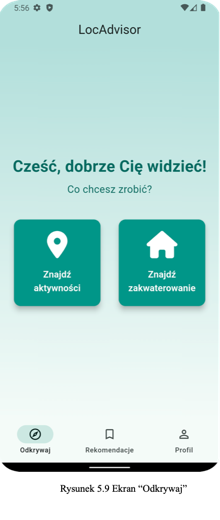
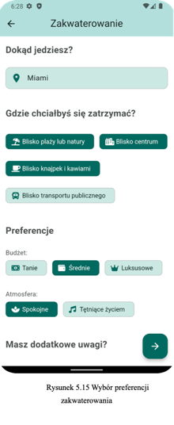
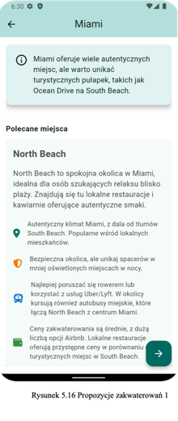
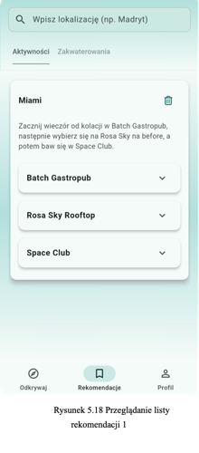

# LocAdvisor

LocAdvisor is a mobile application designed to help travelers discover **unique and authentic local experiences**.  
The app is built using **Flutter** and leverages **Firebase** for backend services.  
It integrates **AI-powered recommendations** (via OpenAI API) to provide personalized activity suggestions based on user
preferences.

---

## Problem Statement

Travelers often struggle to find authentic experiences beyond mainstream tourist attractions.  
Existing solutions (e.g. TripAdvisor, Google Maps) prioritize popularity rather than personalization.

**LocAdvisor** addresses this challenge by combining:

- User preference modeling
- AI-based recommendations

to deliver **personalized suggestions** for activities and neighborhoods.

---

## Features

- **Personalized Recommendations** – AI-driven suggestions tailored to user preferences.
- **Local Experience Focus** – Prioritizes authentic, non-touristy spots.
- **Spontaneous Activity Discovery** – Instant suggestions without heavy planning.
- **Trip Planning Assistance** – Helps organize activities for upcoming trips.
- **Demo Mode** – Users can explore features without creating an account.

---

## System Architecture

```
User → Flutter Frontend → Firebase Backend (Firestore, Auth, Cloud Functions) → OpenAI API → Recommendations
```

---

## Technologies Used

- **Frontend:** Flutter (Dart)
- **Backend:** Firebase (Firestore, Authentication, Cloud Functions)
- **AI Integration:** OpenAI API for intelligent recommendations

---

## Run LocAdvisor Locally

### Navigate to the project directory:

```sh
cd loc-advisor
```

### Install dependencies:

```sh
flutter pub get
```

### Run the app:

```sh
flutter run
```

---

## Screenshots

### Home Screen



### Activity Filters



### Recommendations View



### Saved Recommendations



---

## Related Documents

- [Engineering Thesis (Polish, full text)](./engineering_thesis.pdf)

---

## License

This project is released under the MIT License.
